> [!WARNING]
>
> ==================================================
> 
> [PLEASE READ THE FORMATTED VERSION OF THIS DOCUMENT HERE (CLICK)](https://netheria.github.io/Performance-Testing-Strategy/)
>
> ==================================================

# Introduction

**A theoretical, evidence-driven performance testing strategy for a distributed, stateful contact-center system.**

<p align="center">
  
</p>

<p align="center"><i>Illustrative only: methodology, not a fixed calendar.<br/>Foundation → Core performance cycle → Engineering feedback → Automation.</i></p>

- **Scope:** Client/Bot/Agent workflows, Message Broker, WebSockets, Database, Kubernetes.
- **Approach:** Observe → Analyse → Optimize → Re-test; evidence over guesswork.
- **Outcome:** Capacity, Efficiency, Stability, Regression Evidence.

> [!WARNING]
> **⚠️ WARNING**
>
> - **Theoretical Performance Testing Strategy** separates the strategy from implementation details, testing frameworks, individual test plans, test cases, and test reports.
>
>   *For practical examples of how similar performance-testing principles can be implemented:*
>
>   *[k6 Performance Testing Framework](https://github.com/Netheria/k6-Performance-Testing-Framework)*
>
>   *[JMeter Performance Testing Framework](https://github.com/Netheria/JMeter-Performance-Testing-Framework)*
>
>   *These repositories are not direct implementations of this strategy, but the closest practical references that apply comparable ideas.*
> - It separates the strategy from implementation details, testing frameworks, individual test plans, test cases, and test reports.
> - The repository also serves a mentoring and portfolio purpose. Therefore, the strategy **may contain more explanation and contextual detail** than a concise internal process document.
>
>   *Expect a teaching-oriented level of detail, not a minimal internal checklist.*
> - **💬 Commentary** represents my direct thoughts and additional information for a subsection's topic.

## About Product

This strategy describes performance testing for a distributed, stateful contact-center application that handles conversations across multiple communication channels.

The target system is a **Kubernetes-deployed microservice-based application integrated with Prometheus**.

It consists of:

- Backend
- Frontend / Agent workspace
- Relational Database
- Message Broker
- Channel-specific Connectors

Each supported conversation channel has a dedicated Connector responsible for receiving messages from the channel, transforming them into the Backend contract, and forwarding them to the Backend through the Message Broker.

Communication between Connectors and the Backend is asynchronous and uses a message broker configured for **at-least-once delivery**.

The primary actors in the business workflow are:

- **Client** - communicates through a conversation channel
- **Bot** - performs automated conversation steps before or during human support
- **Agent** - handles conversations assigned by the application

A typical conversation therefore crosses several system boundaries:

```mermaid
flowchart LR
    A["<b>Client initiates<br/>conversation</b>"]
    B["<b>Conversation<br/>Channel</b>"]
    C["<b>Channel<br/>Connector</b>"]
    D["<b>Message<br/>Broker</b>"]
    E["<b>Backend</b>"]
    F["<b>Database /<br/>Bot / Assignment<br/>Logic</b>"]
    G["<b>Bot or Agent<br/>responds</b>"]
    H["<b>Message<br/>Broker</b>"]
    I["<b>Channel<br/>Connector</b>"]
    J["<b>Conversation<br/>Channel</b>"]
    K["<b>Client</b>"]
    
    A --> B
    B --> C
    C --> D
    D --> E
    E --> F
    F --> G
    G --> H
    H --> I
    I --> J
    J --> K
    
    classDef box stroke:#00A1A1,stroke-width:2px,color:#00A1A1,font-weight:bold,border-radius:10px
    class A,B,C,D,E,F,G,H,I,J,K box
```

Agents interact with the Backend through their workspace, including WebSocket communication used for relevant asynchronous application events.

The resulting workload is not a collection of independent API requests.

Client actions, Bot actions, Agent actions, asynchronous message delivery, database state and conversation assignment are interdependent parts of the same business workflow.

## Operating Conditions

The strategy intentionally considers a constrained environment in which some information required for performance testing may be unavailable:

1. Formal SLAs, SLOs or performance NFRs may not exist.
2. Business and technical requirements may need to be established or refined through engineering investigation.
3. Formal user stories or documented usage flows may be incomplete.
4. Production performance telemetry may be unavailable.
5. System documentation may be incomplete.
6. Required workload and test-data information may need to be obtained through production research rather than invented.
7. The performance environment may have substantially fewer resources than production.

These constraints are treated as explicit limitations of the testing process rather than hidden assumptions.

The intended audience is broad, including technical roles such as Tech Leads, Team Leads and Developers, as well as non-technical stakeholders.

<p align="center"><b>Happy Reading!</b></p>

---

# Performance Testing Strategy

## 1. Purpose

The purpose of performance testing is to produce reliable evidence about how the system behaves under realistic workload and to use that evidence to make engineering decisions.

The strategy is not limited to answering:

> **"How fast is the API?"**

The objective is to understand the behaviour of the complete business workflow, including synchronous operations, asynchronous message processing, shared application state, and the infrastructure supporting the workflow.

It is intended to answer broader questions:

- Which business transaction becomes slower under load?
- At what workload does performance degradation begin?
- Is degradation visible only during workload increase or also during steady state?
- Are Client-to-Connector and Connector-to-Backend message flows processed as expected?
- Does the Message Broker sustain the required message flow without becoming a bottleneck or causing excessive delays?
- Does the at-least-once delivery model result in observable delivery, retry, or duplication behaviour that affects the workflow?
- Are Bot and Agent responses delivered back to the Client within the expected workflow?
- Are WebSocket notifications delivered within an acceptable time?
- Are database connections or other shared resources becoming saturated?
- Are Kubernetes resources being used efficiently?
- Do Client, Bot and Agent workflows continue to behave as intended under load?
- Does the system remain stable during prolonged execution?
- Can infrastructure be optimized without compromising user experience or workflow correctness?
- How does a new build compare with the established performance baseline?

The underlying engineering objective is to determine the workload and infrastructure configuration at which the application can support the required business workflow reliably and efficiently, while providing enough evidence to explain performance degradation, capacity limitations, and meaningful improvements.

---

## 2. Strategy Principles

### 2.1 Test System Behaviour, Not Isolated Endpoints

Performance scenarios should represent meaningful system and business workflows rather than a collection of independent requests.

The workload should preserve the relationships between actors, application state and asynchronous processing. Client, Bot and Agent actions may affect the same conversation and therefore cannot always be modelled independently.

The performance model should account for the complete workflow, including:

- state transitions between related actors
- Connector and Message Broker processing
- asynchronous message delivery
- WebSocket events
- dependencies between Client and Agent actions
- business outcomes required for the workflow to remain valid.

Individual HTTP requests, database queries, broker operations and WebSocket events are measurements within the workflow, not the workload model itself.

The purpose of the performance scenario is therefore to reproduce the behaviour of the system under realistic conditions rather than merely generate traffic against its interfaces.

### 2.2 Observe Before Interpreting

A performance measurement should not be interpreted in isolation.

Application performance, infrastructure behaviour, database activity, asynchronous communication, generated workload and business/workflow behaviour should be correlated before drawing conclusions.

The same principle applies to both degradation and improvement.

A slower transaction may indicate a regression or bottleneck, but a faster transaction may also be misleading if:

- the workload changed
- part of the business workflow was not exercised
- asynchronous processing was delayed or skipped
- an expected business event was not produced
- another part of the workflow failed silently.

Performance results should therefore be evaluated as evidence of system behaviour rather than as isolated numerical changes.

### 2.3 Preserve Evidence Independently from Presentation

Performance data should be separated from the tools used to visualize or report it.

Raw time-series measurements may be retained in the metrics storage system for a defined retention period appropriate to operational and analysis needs.

Processed test results should be persistently stored as structured datasets independently from that retention period.

These persistent results provide the historical evidence required for:

- build-to-build comparison
- regression analysis
- performance trend analysis
- later investigation without requiring the original raw time-series data.

The reporting or visualization layer should therefore consume stored evidence rather than become the only place where performance results exist.

### 2.4 Performance Testing Is an Engineering Feedback Loop

Performance testing is an iterative engineering process rather than a one-time execution followed by a pass/fail conclusion.

The purpose of iteration is to use measured evidence to understand system behaviour, identify performance constraints, apply an engineering change, and verify the effect of that change through re-testing.

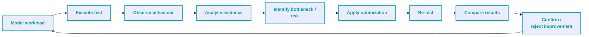

A performance test can therefore produce one of two equally important outcomes:

- evidence that the system requires optimization
- evidence that an optimization produced a meaningful improvement

In both cases, the result should feed the next engineering decision.

The objective of iteration is not to repeatedly run the same test. It is to progressively improve understanding of system capacity, performance behaviour, resource efficiency and remaining constraints.

---

## 3. Objectives

The ultimate objective of performance engineering is to determine how the system can support the required workload **reliably and efficiently**, while using an appropriate amount of infrastructure resources.

From an engineering and business perspective, performance optimization can improve infrastructure efficiency in two primary ways:

1. **Increase supported workload without increasing infrastructure resources.**
2. **Reduce infrastructure resources while maintaining the required workload capacity and system behaviour.**

These two outcomes are not achieved by measuring response times alone.

The strategy therefore uses several complementary performance-testing objectives to understand system behaviour and determine where improvements are possible.

### 3.1 Performance Characterization

Establish how system behaviour changes as workload increases.

Characterization should identify:

- how application and workflow performance changes across workload levels
- when degradation begins
- whether degradation is gradual or sudden
- whether behaviour differs between workload phases
- which parts of the workflow are most affected
- whether asynchronous processing and WebSocket communication remain healthy
- how application behaviour correlates with infrastructure utilization.

Characterization provides the evidence needed to understand the relationship between **workload, performance and resource consumption**.

### 3.2 Capacity

Determine the sustainable workload that a defined infrastructure configuration can support while maintaining required system and business behaviour.

Capacity analysis should identify:

- sustainable workload limits
- the limiting resource or component
- workload distribution between Client, Bot and Agent actors
- the relationship between workload and infrastructure utilization
- the point at which additional workload produces unacceptable degradation.

Capacity establishes the baseline for determining whether the existing infrastructure is being fully utilized and whether additional workload can be supported without increasing resources.

### 3.3 Resource Efficiency

Determine whether the required workload can be supported using resources more efficiently.

Resource-efficiency analysis should investigate two directions:

1. **Increase workload while maintaining infrastructure**
2. **Maintain workload while reducing infrastructure**

The objective is not to maximize resource utilization at any cost.

An efficient configuration should provide sufficient capacity and acceptable system behaviour while avoiding unnecessary infrastructure allocation.

Resource-efficiency analysis may therefore result in recommendations for:

- infrastructure resizing
- workload distribution changes
- application optimization
- database or connection-management improvements
- Kubernetes configuration changes
- autoscaling configuration
- other engineering changes that improve the workload-to-resource relationship.

### 3.4 Stability

Determine whether the system can maintain acceptable behaviour over an extended period.

Stability testing should identify degradation that may not be visible during shorter executions, including:

- memory or resource growth
- increasing latency
- increasing error rates
- database connection growth
- WebSocket degradation
- conversation/workflow degradation
- infrastructure restarts
- other long-term resource or performance drift.

A system that reaches a suitable capacity briefly but cannot sustain that workload is not considered operationally efficient.

### 3.5 Regression Detection

Determine whether changes to the application or infrastructure materially change its performance behaviour.

Regression analysis should identify:

- performance degradation
- performance improvement
- changes in capacity
- changes in resource utilization
- changes in workflow behaviour
- changes in system stability.

Where formal performance requirements exist, they take precedence.

Where formal requirements are unavailable, controlled comparison against an established reference provides evidence for identifying meaningful changes.

### Objective Relationship

The objectives form a chain rather than independent testing activities:

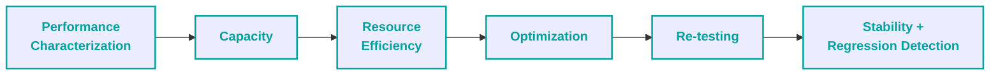

The overall purpose is to establish whether the system can support the required workload **with an efficient and sustainable infrastructure configuration**, and to provide evidence for improving that configuration over time.

---

## 4. Scope

The strategy covers performance characteristics of the application, its supporting infrastructure, and the end-to-end conversation workflows that connect them.

### 4.1 In Scope

#### Application and Workflow Behaviour

- Backend application performance
- Connector application performance
- Stateful Client, Bot and Agent workflows
- Concurrent Client and Agent behaviour
- Conversation assignment and state transitions
- Asynchronous communication
- WebSocket performance
- Business/workflow health and correctness under load

#### Message Broker and Communication Flow

- Message Broker throughput and processing behaviour
- Message delivery success and failure behaviour
- Broker-related delays affecting application workflows
- At-least-once delivery behaviour where it affects performance or workflow correctness
- Connector-to-Backend communication through the Message Broker
- Client-facing message delivery through Connectors
- Network characteristics relevant to the tested workflow

#### Data and Shared Resources

- Database activity relevant to application behaviour
- Database connection usage
- Shared state required for workload execution
- Resource contention that affects workflow behaviour

#### Infrastructure and Observability

- Kubernetes resource consumption
- CPU and memory utilization
- Resource limits and requests where relevant
- Component restarts
- Prometheus-based infrastructure metrics
- Performance observability and correlation of application and infrastructure behaviour

#### Performance Test Activities

- Load testing
- Stress testing
- Capacity testing
- Stability / endurance testing
- Scalability investigation
- Performance regression testing
- Historical performance comparison
- Engineering recommendations and optimization analysis

### 4.2 Out of Scope

Unless explicitly introduced as a separate performance objective:

#### Other Testing Activities

- Functional testing as the primary activity
- Security testing
- Penetration testing
- Accessibility testing
- Compatibility testing

#### Interfaces and System Areas

- Telephony usage in performance testing
- Browser/UI performance
- Detailed network performance analysis
- Deep database performance tuning
- Volume testing involving large file sizes

These are possible extensions rather than core objectives.

---

## 5. System Model

This strategy targets a contact-center system that processes conversations between Clients and Agents through multiple conversation channels.

The system is designed around a common Backend while allowing Clients to communicate through different external conversation channels.

Each supported channel is integrated through its own Connector, which is responsible for translating between the channel-specific message contract and the Backend contract.

A Message Broker provides asynchronous communication between Connectors and the Backend.

Connector-to-Backend message exchanges pass through the Message Broker, which is configured for **at-least-once delivery**.

The Backend maintains the application state required to manage Clients, conversations, messages and Agent assignment.

Bot logic can participate in Client-initiated conversations before the conversation is handled by an Agent.

Agents interact with the system through the Agent workspace.

Relevant application state changes are delivered to connected Agents through WebSocket communication, while Agent actions are sent back to the Backend.

The performance strategy models **Client-initiated conversations**.

Bot or Agent initiation of a conversation without a preceding Client message is outside the performance-testing scope.

### 5.1 System Overview

The system can be viewed as several cooperating layers:

| Layer                   | Responsibility                                                                                            |
| ----------------------- | --------------------------------------------------------------------------------------------------------- |
| Conversation Channels   | Provide the external communication interface used by Clients                                              |
| Connectors              | Receive channel messages, transform contracts and communicate with the Backend through the Message Broker |
| Message Broker          | Provides asynchronous message transport between Connectors and the Backend using at-least-once delivery   |
| Backend                 | Processes application requests, maintains conversation state and performs business logic                  |
| Bot Logic               | Performs automated steps within Client-initiated conversations                                            |
| Agent Workspace         | Allows Agents to receive assignments and interact with conversations                                      |
| Relational Database     | Persists Client, conversation, message and other application state                                        |
| WebSocket Communication | Delivers relevant asynchronous application events to connected Agents                                     |

These components form a single business workflow even though processing may cross several application and communication boundaries.

### 5.2 High-Level System Architecture

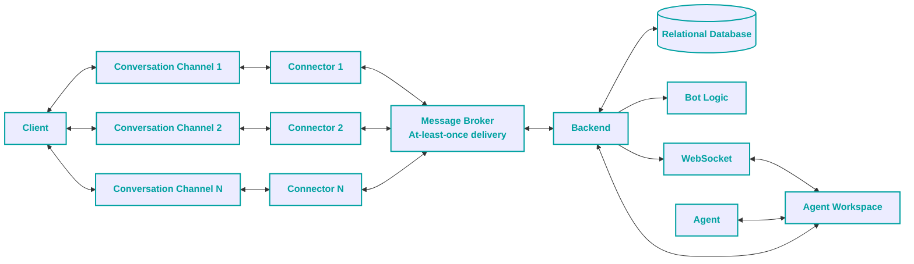

The diagram represents logical system relationships rather than deployment topology.

Kubernetes is the execution environment for the applicable application and infrastructure components and is therefore considered separately when infrastructure behaviour is analysed.

### 5.3 Client-Initiated Conversation Flow

The primary performance workflow begins with a Client message.

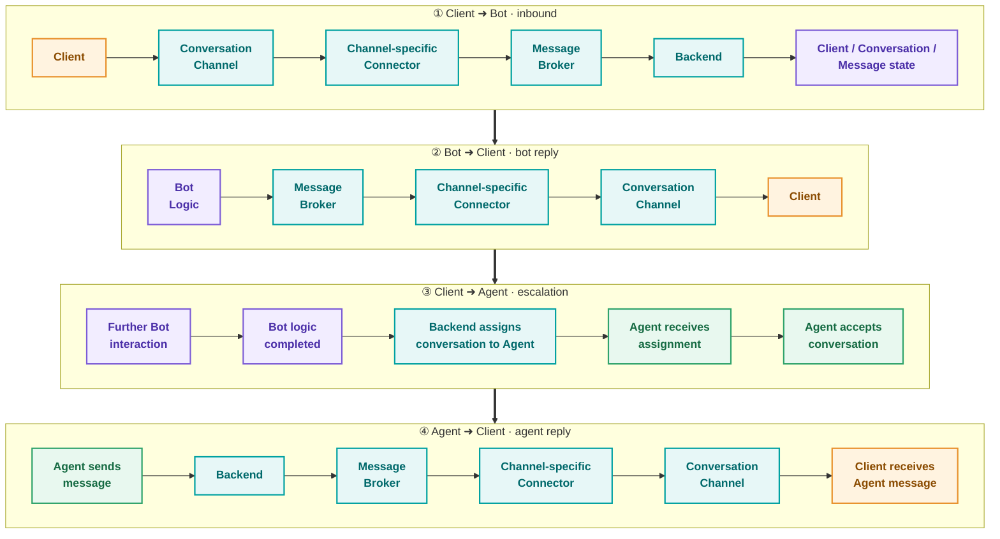

The flow illustrates the major architectural path rather than prescribing a fixed number of messages or actions.

Exact workflow transactions belong to the corresponding Test Plan or Scenario Specification.

### 5.4 Performance-Relevant Characteristics

The system model introduces several characteristics that directly affect performance testing:

- multiple conversation channels with separate Connectors
- asynchronous Connector-to-Backend communication through the Message Broker
- at-least-once message delivery
- shared Client, conversation and message state
- interaction between Client, Bot and Agent actors
- asynchronous Agent notifications through WebSocket communication
- database activity associated with application state
- dependencies between actions performed by different actors

As a result, a request completed successfully at one system boundary does not necessarily mean that the corresponding business operation has completed successfully.

For example, successful processing of a Client message may require:

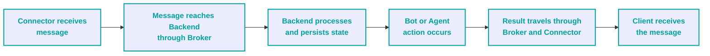

Performance analysis must therefore distinguish between **individual transaction performance** and **end-to-end workflow behaviour**.

---

## 6. Performance Requirements Strategy

Performance requirements define the expected behaviour of the system and provide the basis for evaluating whether measured performance is acceptable for the intended workload.

Possible sources of performance requirements are:

1. business requirements / NFRs
2. contractual SLAs
3. technical SLAs / SLOs
4. production telemetry
5. historical performance baselines
6. agreed engineering benchmarks
7. business-client requirements known by the Support department.

Formal requirements should take precedence over observed production behaviour when both are available.

> [!TIP]
> 💬 **Commentary**
>
> - **Never** underestimate Support Department and their knowledge of business client expectations.
>
>   *They are on the frontier and have the most relevant understanding.*
> - Production performance data and formal performance requirements answer different questions.
>
>   *Production data provides evidence of values that are currently present in the system. Formal requirements represent values that are wanted or expected by the business or engineering organization. For this reason, observed production performance should not automatically be treated as the target. When a formal requirement exists, the required value takes precedence over the current observed value.*
>
>   *Example:*
>
>   | Item | Value |
>   |---|---|
>   | Production currently achieves | 2 seconds |
>   | Formal requirement | 1 second |
>
>   *The 2-second production measurement describes the current state of the system. It does not make 2 seconds an acceptable target when the defined requirement is 1 second. When no formal requirement exists, however, production data can provide valuable evidence for understanding realistic operating conditions and establishing an initial reference point.*
> - There may be cases when defined requirements are unrealistic, won't improve user experience, or would have a negative influence on the system.
>
>   *These cases must be flagged and discussed with a team.*
> - **Telemetry** is a general term for automatically collected information about system usage and behaviour. In practice, this can include logs, metrics, traces, database records, message-processing records and similar operational information.
>
>   *The objective is not to collect every available piece of production data. The objective is to identify the data that can explain how much the system is used, when it is used, how users behave, and which workflows are important.*

### Unavailable Targets

When formal performance targets are unavailable, the absence of those targets should be explicitly documented rather than replaced with invented thresholds.

Available production information, historical results and engineering benchmarks can still be used to characterize current behaviour and establish a controlled reference for comparison.

The resulting analysis may be used to:

- identify current performance behaviour drift
- detect meaningful degradation or improvement
- identify capacity limitations
- identify potential bottlenecks
- provide evidence for establishing or refining future performance requirements

Where formal requirements are subsequently established, requirement-based evaluation can be used alongside or instead of baseline comparison.

> [!TIP]
> 💬 **Commentary**
>
> - Historical comparison is a powerful tool, but it does not mean that business expectations, even approximate ones, are omitted.
>
>   *Conclusions always have to take into account business expectations, even if they are not formally written.*

---

## 7. Workload Modelling Strategy

Performance workload should be derived from **realistic system usage and business behaviour**, rather than from a list of API endpoints.

The purpose of workload modelling is to transform expected or observed system usage into a reproducible workload that preserves the relationships between users, workflows, timing and application state.

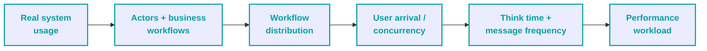

When authoritative usage data is unavailable, assumptions used to construct the workload should be explicitly documented and validated through subsequent testing.

### 7.1 User Types

The reference workload contains at least:

- **Client**
- **Bot**
- **Agent**

These actors are not independent synthetic request generators.

Their actions may affect the same application state and may create work for another actor.

For example:

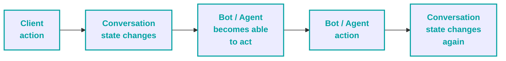

The workload model should therefore define both the actor types and the relationships between their activities.

### 7.2 Stateful Workload

A workload is stateful when the result or availability of an action depends on application state created or modified by previous actions or by another actor.

The performance workload must preserve these dependencies.

For example:

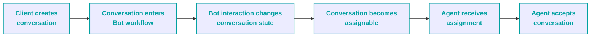

Independently generating requests for each actor may reproduce network traffic but does not reproduce the same stateful workload.

The workflow itself is defined in the System Model and Scenario Specification.

> [!TIP]
> 💬 **Commentary**
>
> - A performance strategy does not require every API endpoint, database query, or asynchronous operation to be enumerated. Those are implementation/inventory details. A strategy is a stable, versioned document that defines goals, methodology, principles, recommendations, standards, and governance - not a fast-changing implementation artifact. It should reference critical systems and sources of truth, and be reviewed and updated when context changes.
> - A complex system may contain hundreds of technical operations, while only a smaller number of business workflows are necessary to represent its performance workload.

### 7.3 Think Time

Think time represents the time between user or system activities within a workflow.

Depending on the actor and workflow, it may represent:

- time between Client messages
- time between Agent messages
- time between Bot interactions
- waiting for an asynchronous event
- waiting before starting the next business activity

Think time should be derived from available workload requirements, production observations, domain knowledge or explicitly documented modelling assumptions.

Where possible, think-time distributions should represent realistic behaviour rather than using a single constant delay for every action.

Exact values and distributions belong in the corresponding Test Plan or Scenario Specification.

### 7.4 Workload Granularity

Workload should be modelled at a level that represents meaningful business behaviour while allowing the underlying technical operations to remain implementation details.

The strategy distinguishes three levels:


A **Business Workflow** represents a complete user or system interaction, such as a Client-initiated conversation progressing from creation through Bot interaction and Agent handling.

A **Business Transaction** represents a meaningful unit within that workflow, such as delivering a Client message or assigning a conversation to an Agent.

**Technical Operations** are the individual HTTP requests, WebSocket events, database operations, webhook processing steps and Message Broker interactions used to implement the transaction.

One business transaction may therefore contain multiple technical operations across several system components.

The workload model should be defined using business workflows and meaningful transactions. Technical operations are then implemented as the mechanism required to reproduce that workload.

> [!TIP]
> 💬 **Commentary**
>
> - The purpose of the Strategy is to define **how the workload is modelled**, while the Test Plan and implementation define **which concrete operations execute that model**.

---

## 8. Workload Data Sources

Workload modelling should be based on the best available evidence of how the system is actually used.

The preferred order of evidence is:

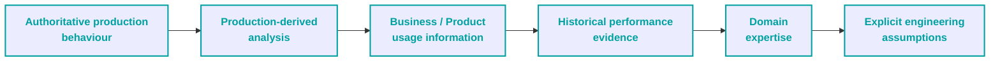

Higher-quality sources should be preferred when several sources are available.

When authoritative workload information is unavailable, assumptions should be explicitly documented rather than presented as observed production behaviour.

### 8.1 Production Behaviour

Production-derived information is the preferred source for understanding actual workload characteristics.

Depending on the system, useful information may include:

- Client and Agent concurrency
- peak and off-peak periods
- conversation arrival rate
- message frequency
- conversation duration
- Client / Agent ratios
- channel distribution
- feature or workflow usage
- state distribution
- database activity associated with business workflows

Production information should be analysed over a sufficiently representative period rather than relying on a single observation.

> [!TIP]
> 💬 **Commentary**
>
> - Analysis over several weeks or months may reveal recurring peak periods, weekday differences, unusual events and longer-term usage trends that are not visible in a short observation window.
> - The larger the timespan - the better, but only if the system functionality didn't experience any dramatic changes.

### 8.2 Production Data Investigation Sources

Workload information may be distributed across several systems.

Potential sources include:

- application and service logs
- access logs
- database tables and event/audit tables
- Message Broker logs, metrics or message-processing records
- monitoring systems
- application metrics
- analytics and event-tracking systems
- existing operational or performance reports
- support and customer records
- product or marketing analytics

The appropriate source depends on which characteristic of the workload is being investigated.

For example:

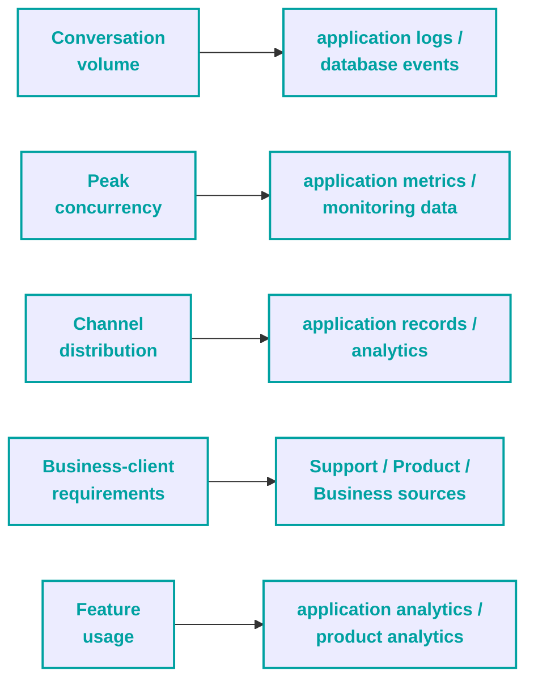

> [!TIP]
> 💬 **Commentary**
>
> - Production data provides information about **what is currently happening**. Business requirements describe **what behaviour is wanted or expected**. These should not be treated as interchangeable.
>
>   *For example, production data may show that most conversations currently use one channel. That does not necessarily mean that the same channel distribution is the required future workload.*
>
>   *Production research should therefore be used to build an evidence-based workload model, while requirements and explicit assumptions determine how that model should be interpreted.*

### 8.3 Product and Marketing Analytics

Product and marketing analytics can provide useful supplementary information about user behaviour.

Examples include:

- website or application analytics
- interaction tracking
- heatmaps
- A/B-test results
- feature usage statistics
- conversion or abandonment data

These sources can help identify which features, pages or interaction patterns are important to users.

> [!TIP]
> 💬 **Commentary**
>
> - Behavioural analytics should not automatically be interpreted as infrastructure workload. Additional analysis may be required to translate a user interaction into the corresponding application workflow and technical workload.
>
>   *You'll learn where users click or what they use, but not the conditions why or when.*
> - **Never** be shy to follow the user usage story manually. This often provides additional understanding and unexpected insights.

### 8.4 Historical Performance Results

Historical test results can provide useful evidence when current production information is unavailable or incomplete.

They may help identify:

- previously observed workload levels
- known bottlenecks
- previous capacity limits
- recurring performance characteristics
- changes in workload or system configuration over time

Historical results should be used with awareness of differences in application version, infrastructure, test-data state and workload model.

### 8.5 Domain Knowledge and Assumptions

Domain knowledge can supplement measured information when direct workload evidence is unavailable.

Examples include:

- expected Client behaviour
- known Agent operating patterns
- business operating hours
- support-team knowledge
- expected channel usage

When assumptions are required, they should be documented together with their source and confidence.

The strategy should distinguish clearly between:

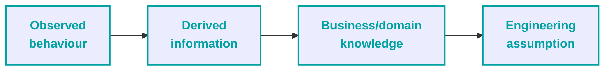

Only the first category should be presented as directly observed production behaviour.

> [!TIP]
> 💬 **Commentary**
>
> - The main source of Domain Knowledge is **your team**!

---

## 9. Performance Test Types

The strategy uses several performance test types to answer different engineering questions.

A performance test type defines the **purpose, workload approach, execution conditions and expected evidence** for a particular investigation.

The test types are complementary rather than mutually exclusive. A single performance investigation may combine several of them, and the sequence may change depending on the available requirements, environment, workload information and previous findings.

### 9.1 Baseline / Reference Measurement

A **Baseline / Reference Measurement** establishes a documented performance reference against which comparable test results can be evaluated.

The preferred reference is a **golden standard defined before performance testing**. Ideally, the required values are established by the Business Analysis or equivalent business function based on business expectations and Client requirements.

When formal performance targets cannot be defined by the Business Analysis department, production research should be used to derive realistic reference values from observed system usage and behaviour.

When neither formal requirements nor sufficient production information is available, a controlled performance test may be executed and its validated results may be used as a temporary reference for subsequent comparisons.

The reference hierarchy is therefore:

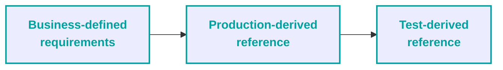

The higher-level source takes precedence when available.

> [!TIP]
> 💬 **Commentary**
>
> - A test-derived reference should not be interpreted as proof that the measured behaviour is acceptable. It only provides a controlled point of comparison until a more authoritative reference can be established.
>
>   *The current build is better than the previous one. But does this mean that it meets the business and client expectations? No.*
> - For better understanding:
>
>   *Requirement: "What should the system achieve?"*
>   *Production observation: "What does the system currently achieve?"*
>   *Test-derived reference: "What did the system achieve under controlled test conditions?"*
> - A baseline / reference should be re-established when the conditions that give it meaning change materially.
>
>   *For example: fundamentally different workload model, infrastructure configuration, application architecture or test objective.*

#### Methodology

1. **Identify available formal requirements.**
   Determine whether Business Analysis, Product, Support or another responsible department has defined expected performance values or business-client requirements.

2. **Research production behaviour when formal requirements are unavailable.**
   Analyse available production information to determine realistic workload conditions and currently observed performance characteristics.

3. **Establish a controlled test reference when neither is available.**
   Execute a valid performance test under documented and repeatable conditions and retain its results as a reference dataset.

4. **Document the source of the reference.**
   The reference should clearly identify whether it represents a formal requirement, production-derived value, or test-derived measurement.

5. **Define the comparison conditions.**
   The workload, scenario, environment, data state, infrastructure configuration and other relevant conditions should be documented so that future results can be compared meaningfully.

6. **Persist the reference.**
   Reference results should be stored as persistent test evidence and remain available for historical comparison.

> [!TIP]
> 💬 **Commentary**
>
> - My advice is to **use versioning with explicit dates for reference documentation**.
>
>   *Hundreds of reference values from different sources. Tens of reference values changed because of a source change. As a result: historical reference is impossible to establish!*

#### Reference by Performance Test Type

The reference is defined according to the objective of the test being performed.

For example:

- **Load Testing** - expected performance under the defined operating workload
- **Capacity Testing** - expected sustainable workload and corresponding resource configuration
- **Stability / Endurance Testing** - expected behaviour over the defined sustained execution period
- **Scalability Testing** - expected relationship between infrastructure configuration, workload capacity and performance
- **Regression Testing** - previously established reference behaviour of the selected build under equivalent conditions

> [!TIP]
> 💬 **Commentary**
>
> - The reference does not represent one universal set of values for the entire system.

### 9.2 Load Test

#### Purpose

- determine whether the workload can be sustained
- observe transaction and workflow performance
- observe infrastructure utilization
- verify business/workflow health during normal operating conditions.

> [!TIP]
> 💬 **Commentary**
>
> - The purpose of Load Testing is not to discover the absolute maximum the system can survive. Its purpose is to evaluate whether the system behaves appropriately under a workload representative of intended operation.
> - **Expected workload / operating level** here is a number of users at which the system is stable during arrival. Usually, the number is 80-90% of the maximum number of users found during the Capacity Test.

#### Methodology

1. Define the expected workload from requirements and available production evidence.
2. Configure Client, Bot and Agent activity according to the workload model.
3. Execute the workload at the intended operating level.
4. Allow the workload to reach and maintain its intended steady state where applicable.
5. Observe application, Message Broker, database, WebSocket, infrastructure and business/workflow behaviour.
6. Analyse both workload performance and resource utilization.
7. Compare the resulting behaviour against formal requirements or the selected reference.

Load testing should represent the workload the system is expected to support rather than maximize generated traffic.

> [!TIP]
> 💬 **Commentary**
>
> - Knowledge obtained from **Capacity, Stress or Scalability testing** may be used to select a realistic operating level, identify expected limits or determine appropriate infrastructure configuration.

#### Prerequisites / dependencies

- implemented and validated Test Plan
- defined or derived expected workload
- required observability
- suitable test environment
- capacity information where needed to establish the operating point

### 9.3 Stress Test

#### Purpose

- deliberately increase workload beyond the expected operating level
- identify degradation points
- identify resource saturation
- determine sustainable behaviour under increasing demand
- identify system failure modes
- observe recovery behaviour where recovery is part of the investigation

#### Methodology

1. Establish a realistic initial workload.
2. Increase workload progressively according to a defined ramp-up model.
3. Observe application, workflow and infrastructure behaviour throughout the increase.
4. Identify the point at which significant degradation, saturation, instability or errors begin.
5. Continue until defined failure criteria are reached.
6. Reduce workload according to the defined recovery model and observe system recovery.
7. Observe the system recovery process.
8. Stop automatically or manually when predefined critical infrastructure conditions make further testing invalid or unsafe.
9. Preserve evidence around the degradation and failure point.
10. Analyse the relationship between increasing workload, system behaviour, recovery process and resource utilization.

The ramp-up model should be based on available workload evidence where possible rather than an arbitrary sharp increase in users.

Production observations can be used to understand how workload increases during representative peak periods. The resulting model can then be adapted to the capacity and limitations of the performance environment.

Stress testing should investigate **how the system degrades**, not merely how many requests can be generated before something fails.

#### Prerequisites / dependencies

- implemented and validated Test Plan
- reliable observability
- defined critical failure conditions
- automatic or controlled failure handling where required
- sufficient logging and execution evidence

> [!TIP]
> 💬 **Commentary**
>
> - The Stress testing has multiple variations concerning the workload decrease model and the number of times the failure point is reached. **There is no silver bullet strategy here**, and the chosen approach is specific to the individual product.
> - Mindlessly increasing workload until infrastructure fails may establish a maximum failure point, but it provides limited information about how the system behaves on the way to that point.
>
>   *A useful Stress Test should expose the relationship between increasing workload, application behaviour, infrastructure utilization, degradation, saturation/failure and recovery behaviour.*
>
>   *This information can then be used to define safer operating levels, identify bottlenecks and guide capacity or optimization work.*
> - Stress testing is usually done with 115-125% workload, but the **arrival rate of users is also a crucial point**! Arrival rate (ramp-up) shouldn't be some extreme invented value, it should be taken from peak operation times on production and tightened up a bit.

The degradation relationship described above can be visualized as:

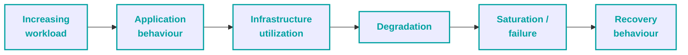

### 9.4 Capacity Test

#### Purpose

- determine sustainable workload capacity for a defined infrastructure configuration
- identify the limiting resource or component
- determine the relationship between workload and resource utilization
- provide evidence for infrastructure sizing efficiency

#### Methodology

1. Establish initial infrastructure configuration.
2. Increase workload gradually according to a defined ramp-up model.
3. Observe application, workflow, and infrastructure behaviour throughout the increase.
4. Identify infrastructure resource utilization trend.
5. Continue until resource saturation or degradation becomes critical.
6. Identify sustainable capacity.
7. Analyze results and provide sizing recommendations.

Capacity testing uses controlled workload increases to determine the highest sustainable operating level at which required application and business behaviour remains acceptable.

The workload should be increased gradually enough to distinguish sustainable capacity from transient saturation or instability.

The analysis should consider both total workload and the distribution of Client, Bot and Agent activity.

> [!TIP]
> 💬 **Commentary**
>
> - If formal initial infrastructure configuration is not defined then replicating production configuration is a reasonable choice.
> - Gradual users increase ramp-up model is required to not stress the system (not goal of this test) and have maximum role utilization.
> - Capacity testing should not focus solely on the maximum number of requests that can be generated regardless of which request it is and how business logic fares.
>
>   *The target is: Determine the sustainable workload that can be supported by a defined infrastructure configuration while maintaining acceptable application and business behaviour.*
> - Capacity analysis should find an acceptable balance.
>
>   *Consider balance between:*
>   *- client users' experience / system performance*
>   *- application users' number / their utilization*
> - Resources for the component should not be allocated to the very limit in the recommendation, as even a tiny increase would cause a failure. Take into account volatility: resources should be allocated with at least a small margin.
>
>   *Here are general rules:*
>   *1. An infrastructure configuration that supports the workload but significantly over-provisions resources may not be considered optimal.*
>   *2. An infrastructure configuration that supports maximum possible users but compromises user experience is unacceptable.*
>   *3. Margin size is debatable and must be defined by a system architect or tech lead. It is defined based on workload variability, performance volatility, scaling characteristics and business risk.*

#### Prerequisites / dependencies

- implemented and validated Test Plan
- reliable observability
- defined critical failure conditions
- automatic or controlled failure handling where required
- sufficient logging and execution evidence

> [!TIP]
> 💬 **Commentary**
>
> - The prerequisites / dependencies points are the same as in Stress Test, but the logical explanation of them is totally different.
>
>   *Reliable observability and, preferably, automatic failure detection are required because Capacity Test with a gradual increase in the number of users can have a long duration. Especially because failure criteria can be forgiving and small errors are ignored.*
>
>   *Logging and execution evidence are required not just to find a single failure point but to trace the problems throughout the whole test duration.*

### 9.5 Stability / Endurance Test

#### Purpose

- evaluate system behaviour over an extended period
- detect memory or resource drift
- identify long-term latency or error-rate changes
- identify gradual workflow degradation
- detect infrastructure instability or repeated service restarts

#### Methodology

1. Define the target workload from available requirements and production evidence.
2. Configure Client, Bot and Agent activity according to the workload model.
3. Establish the intended operating level and allow the system to reach a representative steady state where applicable.
4. Maintain the workload for the defined extended execution period.
5. Continuously observe application, Message Broker, database, WebSocket, infrastructure and business/workflow behaviour.
6. Analyse metric trends throughout the execution rather than relying only on aggregated results for the whole test.
7. Compare behaviour across different periods of the execution to identify progressive changes, including latency growth, increasing variability, resource growth, error-rate changes, workflow degradation or repeated instability.
8. Correlate observed changes with application, infrastructure and workload events to distinguish normal fluctuation from progressive deterioration.
9. Determine whether the system maintained the required behaviour throughout the sustained workload.
10. Preserve the results and identified trends as evidence for stability conclusions and further investigation.

A representative sustained workload is maintained for a sufficiently long execution period while trends in application, infrastructure, database, WebSocket and business/workflow metrics are monitored.

The analysis should distinguish temporary fluctuations from progressive deterioration.

> [!TIP]
> 💬 **Commentary**
>
> - Usually, **extended duration** means at least three times longer than load testing.
> - The defining characteristic of a Stability / Endurance Test is the extended observation period. The workload model may be similar to Load Testing, but the analysis additionally focuses on behaviour that develops over time. In short, it has a different investigation objective and analytical approach.
>
>   *The differences are:*
>   *- Extended duration means more data points, which provides more precision in analysis of aggregation results.*
>   *- More data points provide the ability to not only use different analytical methods but also to better see trends in metrics.*
>   *- Extended duration does provide a stronger basis in identification of resource leaks and volatility increase.*

#### Prerequisites / dependencies

- implemented and validated Test Plan
- defined or derived sustained workload
- reliable observability for the complete execution period
- suitable test environment
- established operating level or capacity information
- defined duration and workload-maintenance conditions
- sufficient storage and retention for the increased volume of monitoring and test-result data
- logging and execution evidence sufficient to investigate events occurring throughout the test

### 9.6 Scalability Test

#### Purpose

- determine how capacity changes when infrastructure resources change
- evaluate whether additional resources provide useful additional capacity
- identify non-linear scaling and changing bottlenecks
- evaluate resource efficiency across configurations

> [!TIP]
> 💬 **Commentary**
>
> - From experience: regardless of how formalized scalability requirements are, the testing and/or results review must be done with DevOps. This significantly improves time efficiency and negates possible future miscommunications.

#### Methodology

The workload is tested against controlled infrastructure configurations while keeping other relevant conditions sufficiently comparable.

Scalability should be evaluated empirically.

Depending on horizontal or vertical scalability strategy, the analysis should determine different aspects.

**Vertical scalability**

1. Increase distributed resources.
2. Observe change in capacity.
3. Observe change in performance.
4. Analyze resource usage efficiency.
5. Provide scaling recommendations.

Analysis should answer questions:

- whether additional resources increase capacity
- whether scaling is approximately proportional
- which component becomes the bottleneck
- where diminishing returns begin
- whether autoscaling policies are appropriate

**Horizontal scaling**

1. Increase pod resource usage over autoscaling limit.
2. Observe new replica being added.
3. Observe change in performance.
4. Analyze resource usage efficiency.
5. Decrease pod resource usage over downscaling limit.
6. Observe replica being terminated.
7. Analyze change in performance.
8. Analyze resource usage efficiency.

Analysis should answer questions:

- whether autoscaling adds new replica without significant delay
- whether autoscaling doesn't break load balancing logic
- whether operational resource usage is optimal
- whether downscaling doesn't break component concurrency
- whether downscaling routes business workflow from terminated replica to available one

> [!TIP]
> 💬 **Commentary**
>
> - Most of the time, scalability strategy is hybrid: some components use vertical scalability (where concurrency can easily be routed - like in Connector) and other horizontal (where different improvement approach is chosen - like in relational Database).

#### Prerequisites / dependencies

- implemented and validated Test Plan
- defined or derived workload model
- defined infrastructure configurations to be compared
- identified scaling mechanism for the component under investigation
- reliable observability across application, infrastructure and business/workflow behaviour
- suitable test environment capable of applying the required infrastructure configurations
- defined criteria for evaluating capacity, performance and resource efficiency across configurations
- sufficient execution evidence to compare configurations under equivalent conditions
- participation of the responsible infrastructure / DevOps personnel where infrastructure scaling behaviour or configuration is being evaluated

### 9.7 Regression Test

#### Purpose

- identify meaningful performance degradation
- confirm performance improvements
- detect changes in capacity or resource efficiency
- distinguish application changes from differences caused by workload or environment
- provide evidence to support a release decision.

#### Methodology

Regression should be done against performance requirements that define expected behavior and comparison should preserve equivalent workload, scenario, environment, data state and other relevant conditions.

If formal performance requirements and reliable production baselines are unavailable or outdated, then comparison of the current build against previous build data is acceptable.

**Mode A - Requirements-Based**

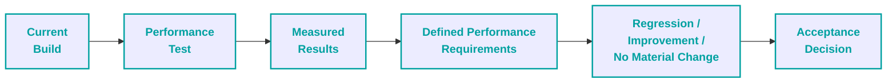

**Mode B - Baseline-Based**

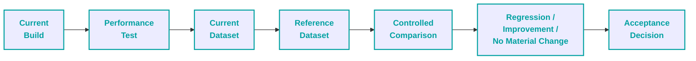

> [!TIP]
> 💬 **Commentary**
>
> - Regression Test **may not be a single test but a whole process**.
>
>   *For example:*
>   *- CI pipeline has workflow with lightweight smoke test for new build*
>   *- CI/CD has a job to automatically run regression test for new build in test / staging environment*
>   *- Results are reviewed and judgement to run additional tests is made*

#### Comparison Dimensions

Comparison should be performed at meaningful levels:

- transaction latency
- percentiles
- throughput
- error rate
- variability
- WebSocket latency
- database behaviour
- resource utilization
- business/meta metrics.

The comparison should also preserve equivalent test conditions:

- same workload model
- same scenario version
- same environment configuration
- comparable test duration
- comparable data state
- comparable infrastructure configuration.

Otherwise, a difference may be caused by the test rather than the application.

### 9.8 Typical Relationship Between Test Types

The test types may be applied in different orders depending on the performance objective and available information.

A common progression is:


This progression is illustrative rather than mandatory.

> [!TIP]
> 💬 **Commentary**
>
> - For example, Capacity Testing may provide the information required to select a realistic Load Test operating point, while Stress Testing may reveal a bottleneck that must be resolved before a meaningful Stability Test can be performed.

---

## 10. Scenario Design

Performance scenarios should model complete workflows whenever application state, asynchronous processing or dependencies between actors affect the outcome.

### Generalized Client / Agent Lifecycle

#### Test Plan Scenario

The generalized scenario can be represented as a state model. Each state represents a meaningful business state of the actor, while transitions represent business actions or reactions to application events.

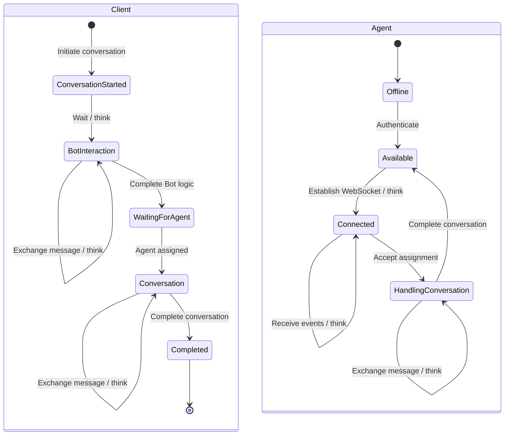

The diagram represents the generalized business lifecycle rather than an executable test scenario.

Implementation specifics, including concrete requests, events, parameters, synchronization mechanisms and timing values, are part of the Test Plan and Scenario Specification.

#### Think time

The think time source hierarchy is:

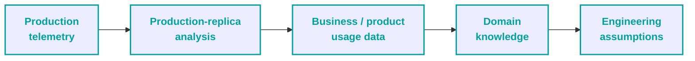

**Think time** should be introduced between applicable business actions to simulate realistic human reaction and interaction time. Exact think-time values and distributions are defined in the Test Plan / Scenario Specification.

When authoritative values are unavailable, assumptions must be explicitly documented and validated through subsequent testing.

> [!TIP]
> 💬 **Commentary**
>
> - **Think time** is a very crucial business parameter which represents product usability.
> - **Production telemetry** does provide information about current user delays but does not represent the business goal. Product improvement plan may dictate different values so the authoritative source takes precedence.

### Scenario Design Rule

A performance scenario should preserve dependencies between actors and system state.

For example:

```mermaid
flowchart LR
    A["<b>Client creates<br/>conversation</b>"]
    B["<b>Application processes<br/>conversation</b>"]
    C["<b>Conversation becomes<br/>assignable</b>"]
    D["<b>Agent receives<br/>conversation</b>"]
    E["<b>Agent responds</b>"]
    F["<b>Client receives<br/>response</b>"]
    
    A --> B --> C --> D --> E --> F
    
    classDef box stroke:#00A1A1,stroke-width:2px,color:#00A1A1,font-weight:bold,border-radius:10px
    class A,B,C,D,E,F box
```

Replacing this dependency chain with independent requests to individual endpoints may generate traffic but would no longer represent the same business workload.

### Cross-Actor Coordination

When a workflow contains dependencies between actors, the scenario implementation must ensure that an actor can react to the required state change or event before continuing with the dependent business action.

For example:

```mermaid
flowchart LR
    A["<b>Client creates<br/>conversation</b>"]
    B["<b>Wait for<br/>assignment</b>"]
    C["<b>Agent receives<br/>assignment</b>"]
    D["<b>Agent accepts<br/>conversation</b>"]
    E["<b>Client / Agent<br/>message exchange</b>"]
    
    A --> B --> C --> D --> E
    
    classDef box stroke:#00A1A1,stroke-width:2px,color:#00A1A1,font-weight:bold,border-radius:10px
    class A,B,C,D,E box
```

The Strategy defines the required dependency between these activities. The mechanism used to implement the dependency is implementation-specific and is therefore not prescribed here.

---

## 11. Observability Strategy

Performance testing should provide enough observable evidence to explain how the system behaves under workload.

Observability must cover not only the time taken to complete individual technical operations, but also:

- whether the expected workload was actually generated
- whether the business workflow remained healthy
- where delays or failures were introduced
- how application and supporting components responded to increasing workload
- whether infrastructure resources were used efficiently
- whether asynchronous processing remained healthy

The observability strategy is therefore divided into complementary layers:

1. Workload Observability
2. Application Performance Metrics
3. Message Broker and Asynchronous Communication Metrics
4. Infrastructure and Database Metrics
5. Business / Workflow Metrics

No single layer is sufficient for performance interpretation.

### 11.1 Workload Observability

The generated workload itself must be observable.

The test should provide evidence for:

- active Client count
- active Agent count
- actor arrival rate
- actor completion rate
- workload distribution by actor type
- workload distribution by conversation channel
- transaction execution count (throughput)
- transaction success / failure count (error rate)
- message count
- message exchange frequency (message throughput)
- achieved workload versus intended workload
- workload phase and duration

> [!TIP]
> 💬 **Commentary**
>
> - Workload observability is required to distinguish application behaviour from problems in workload generation.
>
>   *For example, a reduction in application throughput should not automatically be interpreted as application degradation if the load generator failed to maintain the intended workload.*

### 11.2 Application Performance Metrics

Application performance metrics should describe the time, volume and outcome of relevant technical operations and business transactions.

The test should capture, where applicable:

- operation duration
- transaction duration (latency)
- transaction latency distribution
- throughput
- request / operation count
- success rate
- error rate
- timeout count
- retry count
- response or payload size (where relevant)
- transaction-level variability
- workflow-level latency

Metrics should be distinguishable by meaningful dimensions such as:

- component
- operation or transaction
- endpoint (where relevant)
- conversation channel (where relevant)
- actor type (where relevant)
- test phase
- other dimensions required to isolate materially different behaviours

Application metrics should allow performance analysis at both individual-operation and workflow levels.

### 11.3 Message Broker and Asynchronous Communication Metrics

Because Connector-to-Backend communication is mediated by a Message Broker, broker behaviour must be observable as part of the application workflow.

The observability model should capture, where supported:

- messages produced
- messages consumed
- message processing rate
- message delivery success rate
- message processing latency
- queue or backlog depth
- consumer lag or equivalent pending-work measure
- retry activity
- rejected or failed messages
- dead-letter or equivalent failed-delivery activity
- redelivery activity
- duplicate processing (where it can be identified)
- message age
- broker resource utilization
- connection or consumer health
- channel-specific message flow (where distinguishable)

The exact metrics depend on the selected Message Broker and its monitoring capabilities.

The **at-least-once delivery** model makes delivery and redelivery behaviour particularly important. Performance analysis should therefore consider not only whether a message was eventually processed, but also whether retries, redeliveries or duplicate processing introduce additional load or affect workflow correctness.

For client-visible message delivery, broker-level measurements should be correlated with Connector and application measurements where possible.

A successful Client request therefore should not automatically be treated as successful end-to-end message delivery.

### 11.4 Connector and External Communication Metrics

Each Connector should be observable independently because a separate Connector exists for each conversation channel.

The strategy should capture, where applicable:

- webhook reception rate
- webhook processing latency
- contract parsing / transformation failures
- message forwarding rate
- forwarding latency
- channel delivery success and failure
- retries
- timeout behaviour
- Connector resource utilization
- Connector restart or availability events

Metrics should allow comparison between different Connectors or conversation channels when their behaviour differs materially.

A channel-specific degradation should therefore be distinguishable from Backend-wide degradation.

### 11.5 Database Metrics

Database observability should focus on database behaviour relevant to the tested workflows rather than attempt to replace dedicated database-performance engineering.

The strategy should capture, where available:

- database operation duration
- database operation count
- database errors
- active connections
- connection pool utilization
- connection saturation
- transaction-related errors
- database resource utilization
- relevant lock / contention indicators
- database availability or restart events

The objective is to determine whether database behaviour contributes to application performance degradation, capacity limits or instability.

Detailed query optimization and database internals remain outside the core scope unless introduced as a separate performance objective.

### 11.6 WebSocket Metrics

WebSocket communication should be observable separately from ordinary HTTP request performance.

The strategy should capture, where applicable:

- WebSocket connection count
- connection establishment success / failure
- connection establishment latency
- event send count
- event receive count
- event delivery latency
- event processing latency where measurable
- event errors
- disconnections
- reconnection activity
- expected versus actual event delivery

WebSocket metrics should be correlated with application state changes.

For example:

```mermaid
flowchart LR
    A["<b>Application state<br/>changes</b>"]
    B["<b>WebSocket event<br/>generated</b>"]
    C["<b>WebSocket event<br/>delivered</b>"]
    D["<b>Agent receives<br/>event</b>"]
    
    A --> B --> C --> D
    
    classDef box stroke:#00A1A1,stroke-width:2px,color:#00A1A1,font-weight:bold,border-radius:10px
    class A,B,C,D box
```

A delay or loss at any stage may affect Agent workflow behaviour even when the underlying HTTP operations remain within expected latency.

### 11.7 Infrastructure Metrics

Infrastructure observability should identify how resource consumption changes with workload.

At minimum, the relevant infrastructure should be observed for:

- CPU utilization
- memory utilization
- configured CPU requests and limits
- configured memory requests and limits
- resource throttling where applicable
- network utilization
- network bandwidth
- network packet loss
- component restart count
- pod / instance availability
- replica count
- scaling events
- resource utilization per replica
- infrastructure-level failures

Resource behaviour should be observed at a level that allows individual replicas to be investigated.

Aggregate component behaviour should additionally be analysed across all replicas when determining overall resource efficiency or scaling behaviour.

### 11.8 Business / Workflow Metrics

Business (Meta) and workflow metrics provide evidence that the system continues to perform the intended business process under load.

The strategy should capture, where applicable:

- active Client count
- active Agent count
- Agent utilization
- conversations by lifecycle state
- conversation creation rate
- conversation assignment success / failure
- assignment waiting time
- message exchange completion
- expected versus actual workflow events
- workflow success / failure
- workflow abandonment or timeout where relevant
- Client-visible completion of required actions

These metrics should be used to identify degradation that may not be visible through technical latency metrics.

> [!TIP]
> 💬 **Commentary**
>
> - The strategy intentionally distinguishes between **technical metrics** and **business / workflow metrics**.
> - Latency and volatility (spread) don't show the healthiness of the business workflow.
>
>   *For example:*
>
>   *HTTP latency remains stable → Message Broker latency increases → Waiting conversations increase → Agent utilization decreases → Potential asynchronous workflow degradation.*

A visualization of that example:

```mermaid
flowchart LR
    A["<b>HTTP latency<br/>remains stable</b>"]
    B["<b>Message Broker latency<br/>increases</b>"]
    C["<b>Waiting conversations<br/>increase</b>"]
    D["<b>Agent utilization<br/>decreases</b>"]
    E["<b>Potential asynchronous<br/>workflow degradation</b>"]
    
    A --> B --> C --> D --> E
    
    classDef box stroke:#00A1A1,stroke-width:2px,color:#00A1A1,font-weight:bold,border-radius:10px
    class A,B,C,D,E box
```

### 11.9 Observability Correlation

The individual observability layers should not be interpreted independently.

Performance analysis should correlate:

```mermaid
flowchart LR
    A["<b>Workload</b>"]
    B["<b>Application</b>"]
    C["<b>Connector</b>"]
    D["<b>Message<br/>Broker</b>"]
    E["<b>Database</b>"]
    F["<b>WebSocket</b>"]
    G["<b>Infrastructure</b>"]
    H["<b>Business /<br/>Workflow</b>"]
    I["<b>System<br/>Behaviour</b>"]
    
    A --> I
    B --> I
    C --> I
    D --> I
    E --> I
    F --> I
    G --> I
    H --> I
    
    classDef box stroke:#00A1A1,stroke-width:2px,color:#00A1A1,font-weight:bold,border-radius:10px
    class A,B,C,D,E,F,G,H,I box
```

The purpose of correlation is to establish a plausible relationship between an observed performance symptom and the component or condition contributing to it.

A single metric should therefore normally be treated as an observation requiring context rather than as a complete explanation.

---

## 12. Metric Aggregation & Analysis

Collected metrics should be transformed into analytical evidence at a level that corresponds to the question being investigated.

The aggregation level should preserve the meaning of the underlying measurements rather than combine unrelated operations simply because they occurred during the same test.

### 12.1 Analysis Levels

Performance analysis should distinguish between different levels of system behaviour.

#### Level 1 - Logical Transaction Group Behaviour

Logical transaction groups represent a meaningful set of technical operations belonging to the same business or workflow area.

This level is used to answer questions such as:

- How did the performance of the workflow area change as workload increased?
- Did the system stabilize after ramp-up?
- What was the performance behaviour during steady state?
- Was performance variability consistent?
- Which workflow group degraded or improved?
- Did throughput remain consistent?

#### Level 2 - Individual Transaction Behaviour

Individual transactions represent specific business or technical operations within a logical group.

This level is used to determine:

- which transaction degraded
- which transaction improved
- which transaction contributed most to the change in group behaviour
- whether the issue is isolated to one operation
- whether several operations exhibit the same degradation pattern

#### Level 3 - Component Behaviour

Component-level analysis examines the behaviour of relevant application and infrastructure components, including:

- Backend
- Connectors
- Message Broker
- Database
- WebSocket communication
- supporting infrastructure

This level is used to identify where performance changes occur and whether component behaviour correlates with transaction or workflow degradation.

#### Level 4 - Business / Workflow Behaviour

Business and workflow analysis determines whether technical behaviour resulted in an observable change to the intended workload.

Examples include:

- Client workflow degradation
- increased conversation waiting time
- reduced Agent utilization
- failed or delayed assignment
- missing or delayed asynchronous events
- incomplete message exchange
- unexpected conversation-state distribution

A performance conclusion should use the lowest level necessary to explain the observed behaviour while retaining the higher-level context.

### 12.2 Metric Aggregation

Metrics should be aggregated according to their semantic meaning.

Depending on the metric and investigation, analysis may use:

- average
- minimum
- maximum
- percentile
- count
- rate
- range
- time-based aggregation

Aggregation should be performed for both logical transaction groups and individual transactions where meaningful.

> [!TIP]
> 💬 **Commentary**
>
> - Unrelated operations should not be combined into a single aggregate merely because they were executed during the same test.
>
>   *For example, combining Client message delivery, Agent authentication and database monitoring operations into one latency aggregate would produce a number without a useful semantic interpretation.*
> - Aggregation detail should be selected according to data density and the purpose of the analysis.
>
>   *The objective is to retain enough detail to identify meaningful behaviour without producing unnecessarily fragmented datasets.*
>
>   *Using a 5s bucket when data points are 10s apart wouldn't provide meaningful insights.*

### 12.3 Time Periods

Performance results should be segmented into meaningful periods so that transient and sustained behaviour can be distinguished.

Definitions for periods:

- **Ramp-Up** - workload is increasing and the system may be warming up
- **Max Load / Steady State** - intended sustained workload
- **Whole Run** - complete execution

Any period may be further divided into sub-periods when additional resolution is useful.

Time segmentation should be selected according to the duration and objective of the test.

> [!TIP]
> 💬 **Commentary**
>
> - Long Stability / Endurance Test may be divided into equal or otherwise meaningful intervals to make gradual performance or resource changes visible.

### 12.4 Variability and Spread

Performance analysis should consider not only the central tendency of a metric but also its variability.

The variability (spread) analysis uses **range**, calculated as:

```text
Spread = Maximum value - Minimum value
```

The range provides an absolute measure of how widely observed values vary during the selected period.

For the purposes of this strategy:

```mermaid
flowchart LR
    A["<b>Low spread</b>"]
    B["<b>More predictable<br/>behaviour</b>"]
    C["<b>High spread</b>"]
    D["<b>Greater variability or<br/>performance spikes</b>"]
    E["<b>Further<br/>investigation</b>"]
    
    A --> B
    C --> D --> E
    
    classDef box stroke:#00A1A1,stroke-width:2px,color:#00A1A1,font-weight:bold,border-radius:10px
    class A,B,C,D,E box
```

Spread should be analysed for both logical transaction groups and individual transactions where sufficient data is available.

A high spread does not by itself identify the cause of variability. It identifies behaviour that requires investigation.

> [!TIP]
> 💬 **Commentary**
>
> - Why not standard deviation? From experience, in most cases, people do not understand its meaning.

### 12.5 Data Density and Aggregation Detail

The amount of aggregation detail should reflect the amount of available data.

Percentiles and other statistical summaries should not be added indiscriminately to every dataset merely because they are available.

For example, a dataset containing a large number of observations may support detailed percentile analysis, while a very small dataset may not justify the same level of statistical detail.

Time-based aggregation should also produce enough observations to allow the behaviour of the metric to be evaluated over time.

The appropriate level of detail is therefore determined by:

- number of observations
- test duration
- test objective
- required analytical resolution
- semantic meaning of the metric

### 12.6 Comparative Analysis

Metrics should be compared using equivalent semantic and temporal boundaries.

A comparison should preserve, where applicable:

- the same transaction or transaction group
- the same workload phase
- the same aggregation method
- the same time-period definition
- comparable workload conditions.

For build-to-build comparison, the same principles apply to the workload and environment conditions.

Differences should not be interpreted as performance changes when the compared datasets represent materially different workloads, scenarios or measurement conditions.

### 12.7 Interpretation

Aggregated metrics are evidence for interpretation, not conclusions by themselves.

A meaningful performance finding should connect:

```mermaid
flowchart LR
    A["<b>Observed metric<br/>behaviour</b>"]
    B["<b>Affected transaction /<br/>component</b>"]
    C["<b>Related workload<br/>behaviour</b>"]
    D["<b>Related infrastructure /<br/>asynchronous behaviour</b>"]
    E["<b>Business / workflow<br/>impact</b>"]
    F["<b>Engineering<br/>interpretation</b>"]
    
    A --> B --> C --> D --> E --> F
    
    classDef box stroke:#00A1A1,stroke-width:2px,color:#00A1A1,font-weight:bold,border-radius:10px
    class A,B,C,D,E,F box
```

For example:

```mermaid
flowchart LR
    A["<b>Client message<br/>latency increases</b>"]
    B["<b>Message Broker processing<br/>latency increases</b>"]
    C["<b>Broker backlog<br/>increases</b>"]
    D["<b>Conversation waiting<br/>time increases</b>"]
    E["<b>Possible broker-related<br/>workflow degradation</b>"]
    
    A --> B --> C --> D --> E
    
    classDef box stroke:#00A1A1,stroke-width:2px,color:#00A1A1,font-weight:bold,border-radius:10px
    class A,B,C,D,E box
```

The evidence should be correlated across the relevant observability layers before identifying a probable cause.

> [!TIP]
> 💬 **Commentary**
>
> - The purpose of metric aggregation is not to reduce the amount of data as much as possible.
>
>   *It is to transform large quantities of observations into datasets that are easier to interpret while preserving the information required to identify meaningful performance behaviour.*
>
>   *The appropriate aggregation therefore depends on what question the analysis is trying to answer.*
>
>   *The same raw data may legitimately require several views.*
>
>   *For example: Whole Run → Logical Transaction Group → Individual Transaction → Specific Time Period.*
>
>   *This allows a performance investigation to move from a general observation toward the specific operation or period responsible for it without losing the original context.*

A visualization of that drill-down path:

```mermaid
flowchart LR
    A["<b>Whole<br/>Run</b>"]
    B["<b>Logical Transaction<br/>Group</b>"]
    C["<b>Individual<br/>Transaction</b>"]
    D["<b>Specific Time<br/>Period</b>"]
    
    A --> B --> C --> D
    
    classDef box stroke:#00A1A1,stroke-width:2px,color:#00A1A1,font-weight:bold,border-radius:10px
    class A,B,C,D box
```

---

## 13. Entry Conditions

A performance test should begin only after the conditions required to produce interpretable results have been verified.

Entry conditions are evaluated against the selected **test type, workload model and environment**. Not every condition is equally applicable to every performance test.

### 13.1 Test Definition

Before execution:

- The test objective is defined
- The selected performance test type is appropriate for that objective
- The workload model is documented
- Client, Bot and Agent behaviour is defined
- Conversation-channel distribution is defined where relevant
- Required think-time behaviour is defined
- Dependencies between actors and asynchronous events are identified
- The expected operating level or workload progression is defined

The test should not begin when the intended workload can only be described as an undefined number of requests or virtual users.

### 13.2 Test Environment

Before execution:

- The target application version is identified
- Relevant infrastructure configuration is recorded
- Database configuration and required data state are known
- Message Broker configuration is known
- Connector configuration relevant to the tested channels is known
- Required external dependencies are available
- Network conditions relevant to the test are understood
- Monitoring and observability systems are available

Any known difference from the intended production or reference environment should be documented before execution.

### 13.3 Test Data

Before execution:

- Required Client identities are available
- Required Agent identities are available
- Required conversation state can be created
- Authentication and authorization data required by the workflow are available
- Data uniqueness requirements are understood
- Data reset or cleanup requirements are understood

Insufficient or incorrect test data should prevent execution when it can materially change the workload or application behaviour.

### 13.4 Observability

Before execution, verify that the required evidence can actually be collected.

At minimum, this should include the observability required for the selected test objective across the relevant:

- workload
- application
- Connector
- Message Broker
- database
- WebSocket
- infrastructure
- business / workflow

layers.

A metric should not be considered available merely because the monitoring system exists. The expected data should be verified before execution.

### 13.5 Failure and Recovery Conditions

For tests where degradation or failure is expected:

- critical failure conditions are defined
- required alerts or automatic detection are available
- log collection is available
- recovery observation requirements are defined where applicable
- the procedure for stopping the test is understood

This is particularly important for Stress and Capacity Testing, where continuing execution after a critical infrastructure condition may invalidate later observations or unnecessarily damage the test environment.

### 13.6 Reference and Comparison Conditions

Where comparison is part of the test objective:

- the reference dataset is identified
- the reference source is documented
- workload equivalence is verified
- scenario version is identified
- environment differences are known
- required data-state equivalence is confirmed

### Entry Decision

The test should proceed only when all **critical** entry conditions for the selected objective are satisfied.

Non-critical deviations may be accepted when they are documented and their expected influence on the result is understood.

If a missing condition can materially affect workload correctness, observability, or result interpretation, execution should be postponed or the expected limitation should be explicitly accepted before the test begins.

---

## 14. Exit & Decision Criteria

A performance test should produce enough validated evidence to support an engineering decision.

The decision process should distinguish between **test execution validity**, **observed system behaviour** and **the resulting engineering decision**.

### 14.1 Exit Conditions

A performance investigation can be considered complete when:

- the intended workload was generated or the achieved deviation is documented
- the required execution period or workload range was completed
- required observability data was collected
- application and workflow health was assessed
- relevant infrastructure behaviour was observed
- significant degradation or saturation was investigated
- required comparison data was produced
- known limitations affecting interpretation were documented

Completion of the execution itself does not imply that the system passed.

### 14.2 Decision Process

Results should be interpreted in the following order:

```mermaid
flowchart LR
    A["<b>Test<br/>completed</b>"]
    B["<b>Validate test<br/>result</b>"]
    C["<b>Confirm achieved<br/>workload</b>"]
    D["<b>Evaluate application /<br/>workflow behaviour</b>"]
    E["<b>Evaluate infrastructure<br/>behaviour</b>"]
    F["<b>Compare against<br/>requirements or reference</b>"]
    G["<b>Determine engineering<br/>outcome</b>"]
    
    A --> B --> C --> D --> E --> F --> G
    
    classDef box stroke:#00A1A1,stroke-width:2px,color:#00A1A1,font-weight:bold,border-radius:10px
    class A,B,C,D,E,F,G box
```

### 14.3 Decision Categories

The result should be assigned to an appropriate category:

| Category                       | Meaning                                                                                                   |
| ------------------------------ | --------------------------------------------------------------------------------------------------------- |
| Meets Requirement              | Defined performance requirements were satisfied under the tested conditions                               |
| No Material Regression         | Performance remained comparable with the selected reference                                               |
| Performance Improvement        | A meaningful improvement was demonstrated under controlled conditions                                     |
| Capacity Limitation Identified | A sustainable workload boundary or limiting component was identified                                      |
| Optimization Required          | Evidence indicates that engineering improvement is required before the intended objective can be achieved |
| Investigation Required         | The available evidence is insufficient to explain or confidently interpret the observed behaviour         |
| Test Result Invalid            | Test conditions or evidence were insufficient to support a performance conclusion                         |

A result may belong to more than one analytical category. For example, a test may identify a capacity limitation and simultaneously provide evidence of an optimization opportunity.

> [!TIP]
> 💬 **Commentary**
>
> - A performance result is not simply **Pass** or **Fail**.
>
>   *The same execution can establish capacity, expose a bottleneck, demonstrate an improvement and reveal an unresolved risk at the same time.*

### 14.4 Decision Evidence

The decision should be supported by evidence appropriate to the selected test objective.

Examples include:

- workload achieved versus intended workload
- transaction and workflow performance
- Message Broker processing behaviour
- WebSocket delivery behaviour
- database behaviour
- infrastructure utilization
- resource saturation
- stability trends
- comparison with requirements or reference
- business/workflow health

Formal organizational acceptance criteria, release procedures and risk ownership are defined outside this Strategy when they exist.

> [!TIP]
> 💬 **Commentary**
>
> - A final release or production decision remains the responsibility of the organization or role owning that decision.
>
>   *Business risks are a black box for us.*
>
>   *Imagine a situation when build did not receive a 'green light' from our side, but it has to be released because it contains a new feature that your company must provide according to the contract.*

---

## 15. Test Validity

A performance result should be interpreted only when the execution produced the intended workload and sufficient evidence was collected under controlled conditions.

Successful completion of the test execution does not by itself make the result valid.

### 15.1 Valid Result

A result can be considered valid for its intended purpose when:

- the intended workload was achieved within the accepted deviation
- the scenario executed according to its defined behaviour
- required cross-actor dependencies remained functional
- required observability was available
- the application was in a suitable starting state
- the test environment remained sufficiently stable
- no uncontrolled infrastructure changes materially affected execution
- required external dependencies remained available
- sufficient data was collected for the intended analysis

### 15.2 Qualified Result

A result may still be useful when a deviation exists but its effect can be understood and does not prevent the intended conclusion.

Examples include:

- small workload deviation
- temporary monitoring gap outside the analysed period
- known environment difference
- isolated non-critical infrastructure event
- incomplete data that does not affect the specific conclusion

Such deviations should be documented together with the affected conclusion.

### 15.3 Invalid Result

A performance result should be considered invalid when the available evidence cannot support the intended conclusion.

Examples include:

- the load generator was saturated
- the intended workload was not achieved
- workload distribution materially differed from the defined model
- required synchronization between actors failed
- required asynchronous events were lost without explanation
- Message Broker failure materially changed the workload
- monitoring failed during a critical analysis period
- infrastructure configuration changed unexpectedly
- external dependencies materially affected execution
- required test data was unavailable or incorrect
- the application was unstable before execution
- significant unexplained infrastructure events occurred

> [!TIP]
> 💬 **Commentary**
>
> - Reminder: failure is also a valid result.
>
>   *A new build being 'bad' is one thing, and having corrupted results or being unable to execute a test is an absolutely different thing.*

### 15.4 Validity Check

Validity should be evaluated before interpreting performance results.

```mermaid
flowchart LR
    A["<b>Execution<br/>completed</b>"]
    B["<b>Was intended<br/>workload achieved?</b>"]
    C["<b>Were scenario<br/>dependencies preserved?</b>"]
    D["<b>Was required<br/>evidence collected?</b>"]
    E["<b>Did uncontrolled events<br/>materially affect execution?</b>"]
    F["<b>Valid / Qualified /<br/>Invalid</b>"]
    
    A --> B --> C --> D --> E --> F
    
    classDef box stroke:#00A1A1,stroke-width:2px,color:#00A1A1,font-weight:bold,border-radius:10px
    class A,B,C,D,E,F box
```

If the result is invalid, performance conclusions should not be drawn from that execution.

The test may instead be used to investigate the reason for invalidation, provided that the limitations are clearly separated from conclusions about application performance.

### 15.5 Distributed Execution Validity

Distributed performance testing introduces additional validity conditions.

The execution should verify that:

- load-generation workers remained available
- workers maintained required synchronization
- shared coordination mechanisms remained operational
- centralized metric collection remained available
- result aggregation completed correctly
- loss of a worker or shared service did not materially change the workload

The loss of shared coordination or result infrastructure can invalidate both workload correctness and measurement evidence.

---

## 16. Distributed Performance Testing

Performance workload may be distributed across multiple load-generation workers when a single worker cannot generate the required workload or when distributed execution is required by the test objective.

Distribution should increase workload-generation capacity without changing the defined workload model.

> [!TIP]
> 💬 **Commentary**
>
> - Distributed execution is not a performance-testing objective by itself.
>
>   *It is an execution technique used when the required workload, scenario complexity or test environment exceeds the practical capabilities of a single load generator.*
>
>   *Adding workers should therefore increase the ability to generate the intended workload without unintentionally changing the workload being measured.*
> - Distributed execution may even be required for other reasons, such as when **multi-regional user load must be simulated**.

### 16.1 Distributed Execution Principles

A distributed execution should preserve:

- the defined workload distribution
- actor relationships and cross-actor dependencies
- workload arrival and concurrency characteristics
- scenario behaviour
- measurement consistency
- result aggregation

Workers may require shared coordination when the performance scenario contains dependencies between actors or when state must be maintained across workers.

The coordination mechanism is implementation-specific and should not be prescribed by the Strategy.

### 16.2 Load Generator Capacity

Load-generation infrastructure should have sufficient capacity to generate the intended workload without becoming the limiting factor of the test.

The load-generation environment should therefore be monitored for:

- CPU utilization
- memory utilization
- worker availability
- workload-generation rate
- worker errors
- communication failures
- synchronization failures

A saturated or unstable load generator may produce an invalid performance result even when the application under test remains healthy.

### 16.3 Measurement and Result Consistency

Distributed workers should contribute to a common measurement model so that results from the complete execution can be analysed consistently.

The test should preserve:

- common metric definitions
- consistent timestamps or equivalent temporal alignment
- identifiable workload sources
- complete result aggregation
- sufficient evidence to identify worker-level failures or gaps.

The implementation may use different mechanisms to provide these capabilities. Those mechanisms belong to the implementation and execution documentation rather than to this Strategy.

---

## 17. Reporting Strategy

Performance reporting should transform collected performance evidence into information that can be understood, compared and used for engineering decisions.

A performance report should answer four questions:

### What happened?

Describe the tested workload, execution conditions and observed system behaviour.

### Did performance change?

Compare the observed behaviour against applicable performance requirements or the selected reference.

### Why did it happen?

Correlate application, Connector, Message Broker, database, WebSocket, infrastructure and business/workflow evidence to identify the likely contributors to the observed behaviour.

### What should happen next?

Provide actionable engineering recommendations, additional investigation requirements or confirmation that no further performance action is currently indicated.

### 17.1 Reporting Requirements

The reporting process should preserve enough information to understand both the execution and the resulting behaviour.

A report should provide, where applicable:

- test objective and test type
- workload model
- achieved workload
- tested infrastructure configuration
- relevant application and component versions
- execution period
- application performance results
- Message Broker behaviour
- Connector behaviour
- database behaviour
- WebSocket behaviour
- infrastructure resource utilization
- business / workflow metrics
- identified deviations and validity limitations
- comparison against requirements or reference
- performance findings
- engineering recommendations

The report should distinguish measured facts from interpretation and recommendations.

> [!TIP]
> 💬 **Commentary**
>
> - Native load-generator reporting should not be viewed as a solution for stateful or complex systems.
>
>   *Native reports are generally centered around technical load-generation measurements such as requests, response times, throughput, and errors.*
>
>   *The list above is a bit... more complex.*
>
>   *From my experience, I haven't seen any plugin or 3rd party system that would satisfy such needs.*
>
>   *Therefore, a custom reporting service is the answer, and its development must be thought out as soon as possible.*

### 17.2 Reporting Periods

The reporting strategy separates the execution into meaningful time periods so that transient behaviour can be distinguished from sustained behaviour.

> [!TIP]
> 💬 **Commentary**
>
> - Any period may be further divided into smaller sub-periods when additional analytical resolution is useful, particularly during long Stability / Endurance Tests.
> - The distinction between periods is intended to prevent transient Ramp-Up behaviour from being interpreted as representative of steady-state performance.
>
>   *For example, setup operations are not part of steady phase.*

#### Ramp-Up

The period during which workload is being established or increased. System stabilization may occur during this period, including effects such as HTTP caching, initialization, background activity and other transient conditions.

#### Max Load / Steady State

The period during which the intended sustained workload is maintained. It represents the primary basis for evaluating sustained performance under the selected operating conditions.

#### Whole Run

The complete execution period, including Ramp-Up and Max Load / Steady State. It provides overall execution context and allows events or trends spanning multiple periods to be considered.

### 17.3 Reporting Layers

Reporting should provide different levels of detail for different readers and investigative needs.

The reporting model may contain:

1. **Overview** - workload, major observations and engineering conclusions
2. **Aggregated Analysis** - logical transaction groups, execution periods and system-level behaviour
3. **Transaction Analysis** - individual transaction and operation behaviour
4. **Infrastructure / Component Analysis** - resource and component behaviour
5. **Detailed Evidence** - structured datasets and supporting measurements.

The report should allow the reader to move from a high-level observation to the evidence supporting it without requiring the entire raw dataset to be presented in the main report.

> [!TIP]
> 💬 **Commentary**
>
> - A useful performance report should not simply reproduce the dashboard produced by the load-generation tool: the number of metrics is much higher than in a standard results dashboard table.
>
>   *It must be not just informative but also readable!*
>
>   *Imagine yourself as a frontend developer and UI/UX designer for this problem.*

### 17.4 Performance Findings

Performance findings should be treated as engineering findings rather than simply failed test cases.

A finding should connect:

```mermaid
flowchart LR
    A["<b>Observation</b>"]
    B["<b>Evidence</b>"]
    C["<b>Affected Component /<br/>Workflow</b>"]
    D["<b>Impact</b>"]
    E["<b>Probable<br/>Cause</b>"]
    F["<b>Recommendation</b>"]
    
    A --> B --> C --> D --> E --> F
    
    classDef box stroke:#00A1A1,stroke-width:2px,color:#00A1A1,font-weight:bold,border-radius:10px
    class A,B,C,D,E,F box
```

Examples of finding categories supported by the existing approach:

- CPU saturation
- memory/resource growth
- database connection pressure
- slow transaction
- WebSocket delivery degradation
- service restart
- workflow degradation
- insufficient capacity
- performance regression

The final recommendation should identify an appropriate engineering owner where organizational ownership exists.

---

## 18. Optimization Strategy

Performance optimization should be driven by measured evidence rather than by increasing resources or changing system configuration without understanding the limiting factor.

An optimization cycle should establish:

1. the observed performance problem or efficiency opportunity
2. the component, workflow or resource affected
3. the probable cause supported by available evidence
4. the proposed engineering change
5. the expected effect of that change
6. the result of re-testing under comparable conditions

> [!TIP]
> 💬 **Commentary**
>
> - Performance optimization is an iterative process.
>
>   *A performance test may identify a bottleneck, but the first optimization attempt may not resolve it completely or may move the bottleneck to another component.*
>
>   *Classic example: Database bottleneck → Database optimization → Database performance improves → Backend becomes limiting component → New optimization cycle.*
>
>   *The objective is therefore not simply to remove one bottleneck. It is to progressively improve the relationship between workload, system behaviour and infrastructure resource consumption.*
>
>   *Infrastructure optimization should also be considered together with application optimization. Increasing resources may increase capacity, but reducing the work required to support the same workload may produce a different and potentially more efficient result.*

A visualization of that classic example:

```mermaid
flowchart LR
    A["<b>Database<br/>bottleneck</b>"]
    B["<b>Database<br/>optimization</b>"]
    C["<b>Database performance<br/>improves</b>"]
    D["<b>Backend becomes<br/>limiting component</b>"]
    E["<b>New optimization<br/>cycle</b>"]
    
    A --> B --> C --> D --> E
    
    classDef box stroke:#00A1A1,stroke-width:2px,color:#00A1A1,font-weight:bold,border-radius:10px
    class A,B,C,D,E box
```

### 18.1 Optimization Cycle

```mermaid
flowchart LR
    A["<b>Performance<br/>Evidence</b>"]
    B["<b>Identify Bottleneck /<br/>Inefficiency</b>"]
    C["<b>Determine Probable<br/>Cause</b>"]
    D["<b>Define Engineering<br/>Change</b>"]
    E["<b>Apply<br/>Optimization</b>"]
    F["<b>Re-run Affected<br/>Workload</b>"]
    G["<b>Compare<br/>Results</b>"]
    H["<b>Confirm / Reject<br/>Improvement</b>"]
    
    A --> B --> C --> D --> E --> F --> G --> H
    
    classDef box stroke:#00A1A1,stroke-width:2px,color:#00A1A1,font-weight:bold,border-radius:10px
    class A,B,C,D,E,F,G,H box
```

An optimization should not be considered successful merely because one metric improved.

The re-test should verify that:

- the intended performance characteristic improved
- the workload remained comparable
- the relevant business workflow remained functional
- the improvement did not introduce a new significant constraint
- infrastructure resource usage changed as expected where resource efficiency was the objective.

### 18.2 Optimization Targets

Depending on the identified constraint, optimization may target:

- application code
- database access
- database connection management
- Message Broker configuration or processing
- Connector processing
- asynchronous communication
- WebSocket handling
- infrastructure sizing
- Kubernetes configuration
- autoscaling
- workload distribution
- application configuration

The optimization target should be selected according to the evidence collected during performance analysis rather than according to a predefined preference for application or infrastructure changes.

### 18.3 Re-testing

An optimization should be verified through a controlled re-test.

Where possible, the re-test should preserve:

- workload model
- scenario version
- test-data conditions
- infrastructure configuration unrelated to the optimization
- execution conditions
- measurement and aggregation methodology

The result should then be compared with the pre-optimization reference.

A change should be considered a demonstrated improvement only when the observed difference can reasonably be attributed to the optimization rather than to a change in workload, environment or measurement conditions.

---

## 19. Roles & Responsibilities

**Performance testing is a cross-functional engineering activity**. The responsibilities below describe the **capabilities and ownership areas** that should be covered rather than prescribing a specific organizational structure.

| Responsibility Area                             | Primary Responsibility                     | Typical Contributors                             |
| ----------------------------------------------- | ------------------------------------------ | ------------------------------------------------ |
| Performance strategy and planning               | Performance                                | Development, DevOps, Product / BA                |
| Workload modelling                              | Performance                                | Product / BA, Support, Development, DevOps       |
| Production workload research                    | Performance                                | Support, Product / BA, Development, DevOps       |
| Business and Client expectations                | Product / BA or responsible business owner | Support, Performance                             |
| Scenario design                                 | Performance                                | Development, Product / BA                        |
| Test data and environment preparation           | Performance / responsible system team      | Development, DevOps, DBA                         |
| Performance test execution                      | Performance                                | DevOps, Development                              |
| Application observability                       | Development / Performance                  | DevOps                                           |
| Infrastructure observability                    | DevOps                                     | Performance, Development                         |
| Message Broker / Connector observability        | Development / Performance                  | DevOps                                           |
| Database observability                          | DBA / responsible database owner           | Performance, Development, DevOps                 |
| Performance analysis and reporting              | Performance                                | Development, DevOps, DBA, Product / BA           |
| Performance investigation                       | Performance coordinates                    | Development, DevOps, DBA, relevant domain owners |
| Application optimization                        | Development                                | Performance, DevOps                              |
| Infrastructure optimization and sizing          | DevOps / infrastructure owner              | Performance, Development                         |
| Database optimization                           | DBA / responsible database owner           | Development, Performance                         |
| Performance-tooling development and maintenance | Performance / tooling owner                | Development, DevOps                              |
| Engineering recommendations                     | Performance                                | Relevant technical owners                        |
| Release / business decision                     | Appropriate organizational owner           | Performance, Development, DevOps, Product / BA   |

> [!TIP]
> 💬 **Commentary**
>
> - The table represents a generalized model rather than a mandatory organizational **RACI**.
>
>   *In a smaller organization, several responsibilities may belong to the same person. In a more mature organization, they may be distributed across dedicated Performance Engineering, Development, DevOps, DBA, Product, Business Analysis and Support functions.*
>
>   *Performance QA / Performance Engineer should primarily provide evidence and recommendations, while implementation and organizational decisions remain with the roles responsible for the affected system area or business decision.*

### 19.1 Responsibility Principles

The **Performance** role is responsible for coordinating the performance investigation, defining the performance workload, executing and analysing tests, correlating evidence and providing recommendations.

**Development** is responsible for application implementation and application-level optimization. Development should also contribute technical knowledge required to understand application behaviour.

**DevOps** is responsible for infrastructure implementation and infrastructure-level configuration, including resource sizing and scaling mechanisms.

The **DBA** is responsible for database-specific investigation and optimization where database behaviour is identified as a relevant constraint.

**Product / BA** is responsible for providing or formalizing business expectations and requirements where such a role exists.

**Support** may provide valuable information about business-client expectations, actual customer usage patterns and operational behaviour, particularly when formal product or analytical information is unavailable.

No role is expected to work in isolation during performance investigation.

Findings that cross application, infrastructure, database, messaging or business boundaries should be reviewed with the relevant responsible roles.

---

## 20. Automation & CI/CD

Performance-testing activities should be automated where automation improves repeatability, reduces manual effort or provides useful feedback early in the development lifecycle.

### 20.1 Automated Validation

Automated checks may be integrated into CI/CD for activities such as:

- performance test script validation
- configuration validation
- test-data or environment validation
- load-generation configuration validation
- connectivity and service health checks
- lightweight performance smoke checks
- selected regression checks

The objective is to detect broken performance-test infrastructure or obvious performance changes before a full performance investigation is required.

### 20.2 Practical CI/CD Integration

A practical automation pipeline can be structured as:

1. **Validate**
   - Test scripts
   - Configuration
   - Dependencies
   - Required services

2. **Smoke**
   - Execute a lightweight representative workflow
   - Verify successful workload generation
   - Verify basic workflow completion

3. **Performance Check**
   - Execute selected regression scenario
   - Compare against the established reference
   - Store results

4. **Decision**
   - No significant change → pipeline continues
   - Significant change → investigate / run extended test

A lightweight smoke execution should remain small enough to provide fast feedback.

A regression execution should use a controlled and repeatable workload so that differences can be meaningfully compared with the reference.

When an automated check detects a significant performance change, the next action should be investigation rather than treating the automated result alone as the final performance conclusion.

The exact pipeline stages, commands, thresholds and execution environment belong to the CI/CD implementation.

---

## 21. Architecture Principles for Performance Tooling

The performance-testing solution should be designed to support the characteristics of the system and workload rather than merely generate a high volume of technical requests.

### 21.1 Separation of Responsibilities

The performance-testing solution should separate major responsibilities such as:

- workload generation
- workflow orchestration
- cross-actor coordination
- metric collection
- metric storage
- result processing
- reporting and visualization

A change in one responsibility should not require unnecessary changes to unrelated parts of the testing solution.

### 21.2 Stateful Workload Support

The tooling should support workflows in which one actor's actions depend on application state created or modified by another actor.

The solution should therefore be capable of representing:

- Client / Bot / Agent relationships
- conversation state
- asynchronous workflow transitions
- cross-actor dependencies
- required synchronization

### 21.3 Asynchronous Communication Support

The tooling should be capable of exercising and observing asynchronous communication relevant to the workload, including:

- webhook-driven interactions
- Message Broker-mediated processing
- WebSocket communication
- asynchronous business events

### 21.4 Extensible Observability

The performance-testing solution should allow collection of metrics beyond default request statistics.

Custom metrics should be possible where required to represent:

- business/workflow behaviour
- asynchronous event behaviour
- Message Broker behaviour
- actor activity
- application-specific performance characteristics

### 21.5 Distributed Execution

The solution should support distributed workload generation when a single worker cannot generate the required workload.

Distributed execution should preserve workload correctness, coordination and measurement consistency.

### 21.6 Separation of Workload and Infrastructure

Application-specific workload logic should be separated from reusable testing infrastructure.

This allows the same testing architecture to be adapted to another system by replacing system-specific authentication, workflows, communication handlers and monitoring queries without redesigning the complete testing solution.

> [!TIP]
> 💬 **Commentary**
>
> - Remember **SOLID** principles. Quite similar, right?
>
>   *Development of the whole Test Plan, not only the workload logic, is the same as the development of any other application. It follows the same programming principles and paradigms.*

### 21.7 Reproducibility

The performance-testing solution should allow a scenario to be executed repeatedly under documented conditions.

Workload configuration, scenario version, environment configuration and test-data assumptions should therefore be identifiable for each execution.

> [!TIP]
> 💬 **Commentary**
>
> - A Test Plan may not be the only part of the whole performance testing system.
>
>   *Let's take this case as an example.*
>
>   *We have a complex stateful system, and creating a seeding scenario would take too much time and would be too hard to support.*
>
>   *Why not create a pre-seeded database with data and restore our test environment database with it?*
>
>   *Automate the restoration process with a script, and this script becomes an additional part of the whole testing process.*

### 21.8 Evidence Preservation

The tooling architecture should support independent persistence of performance evidence so that results remain available for historical comparison even when operational metrics have limited retention.

### 21.9 Implementation Independence

These principles describe required capabilities and architectural properties of the performance-testing solution.

They do not prescribe a particular performance-testing framework or implementation technology.

---

## 22. Tooling Strategy

Performance-testing tools should be selected according to the requirements of the workload, system architecture and observability model defined by this Strategy.

The selected tooling should support the capabilities required by the target system, including:

| Capability                  | Purpose                                                                                        |
| --------------------------- | ---------------------------------------------------------------------------------------------- |
| Stateful workflow modelling | Reproduce workflows where actions depend on application state                                  |
| Multiple actor types        | Model Client, Bot and Agent behaviour and their relationships                                  |
| Cross-actor coordination    | Synchronize activities that depend on events or state changes                                  |
| Asynchronous communication  | Exercise and observe webhook, Message Broker and other asynchronous flows                      |
| WebSocket communication     | Generate and measure relevant real-time application interactions                               |
| Custom metrics              | Represent business, workflow and application-specific measurements                             |
| Infrastructure integration  | Correlate workload behaviour with infrastructure resource usage                                |
| Distributed execution       | Generate required workload when a single worker is insufficient                                |
| Result persistence          | Preserve structured performance evidence beyond a single test execution                        |
| Result processing           | Transform raw observations into meaningful analytical datasets                                 |
| Reporting / visualization   | Present complex performance behaviour in a form suitable for investigation and decision-making |
| Repeatable execution        | Reproduce the same workload under documented conditions                                        |
| CI/CD integration           | Provide automated feedback where repeatable performance checks are appropriate                 |

Tool selection should therefore be based on **capability fit rather than popularity or default adoption**.

**A single tool does not necessarily need to provide every capability itself**. Supporting components may be used where this produces a more maintainable and reliable performance-testing solution.

The final tooling architecture should be determined by:

```mermaid
flowchart LR
    A["<b>System<br/>Characteristics</b>"]
    B["<b>Workload<br/>Requirements</b>"]
    C["<b>Observability<br/>Requirements</b>"]
    D["<b>Tooling<br/>Capabilities</b>"]
    E["<b>Performance Testing<br/>Solution</b>"]
    
    A --> B --> C --> D --> E
    
    classDef box stroke:#00A1A1,stroke-width:2px,color:#00A1A1,font-weight:bold,border-radius:10px
    class A,B,C,D,E box
```

The concrete tools, libraries, services and configurations used to implement these capabilities belong to the implementation and Test Plan documentation.

> [!TIP]
> 💬 **Commentary**
>
> - All performance testing frameworks, whether it is Gatling, JMeter, or k6, have their own strengths and weaknesses.
>
>   *From experience, for stateful systems, there is no perfect tool.*
>
>   *All of them would require a certain level of customization via extending functionality by scripts or separate services.*
>
>   *Moreover, most of the time, there is not even a possibility to choose a tool because companies prefer to have everything done in one stack and choose a tool for you.*
> - For practical examples of how similar performance-testing principles can be implemented:
>
>   *[k6 Performance Testing Framework](https://github.com/Netheria/k6-Performance-Testing-Framework)*
>
>   *[JMeter Performance Testing Framework](https://github.com/Netheria/JMeter-Performance-Testing-Framework)*
>
>   *These repositories are not direct implementations of this strategy, but the closest practical references that apply comparable ideas.*

---

## 23. Future Extension Points

The current Strategy defines a core performance-testing scope for the target system.

Additional performance investigations can be introduced when new business requirements, architectural changes or engineering questions justify them.

Each extension below represents a possible expansion of the current Strategy rather than a requirement of the core process.

### 23.1 Detailed Network Performance

**Implementation**

Extend observability and workload analysis to measure network-level characteristics between Clients, Conversation Channels, Connectors, Message Broker, Backend and other relevant components.

Depending on the investigation, this may include latency, packet loss, bandwidth utilization, connection behaviour and other network characteristics.

**Benefit**

Allows network-related constraints to be distinguished from application, Connector or Message Broker performance problems.

### 23.2 Deep Database Performance Analysis

**Implementation**

Extend database monitoring beyond application-relevant query and connection metrics to include detailed database-level analysis such as execution plans, locking, contention, indexing behaviour and resource utilization.

**Benefit**

Provides evidence for database-specific bottlenecks and supports targeted database optimization when database behaviour is identified as a limiting factor.

### 23.3 Browser / User Interface Performance

**Implementation**

Add browser-based performance measurements to the existing workflow, including page rendering, client-side processing and other user-interface performance characteristics.

The measurements should remain correlated with backend and WebSocket activity so that frontend and backend effects can be distinguished.

**Benefit**

Extends the strategy from backend/workflow performance to the actual user-interface experience.

### 23.4 Telephony Performance

**Implementation**

Introduce telephony-specific workload generation and observability for conversation flows involving voice communication, including the required telephony interfaces and infrastructure.

**Benefit**

Allows performance characteristics of voice-based customer interactions to be evaluated using a workload model appropriate to telephony rather than treating them as ordinary messaging workflows.

### 23.5 Volume Testing

**Implementation**

Introduce dedicated scenarios for unusually large data volumes, payloads or stored datasets and define the corresponding storage, processing and transfer measurements.

**Benefit**

Identifies performance behaviour caused primarily by data volume rather than concurrent workload.

### 23.6 Security-Related Performance

**Implementation**

Coordinate performance testing with security testing to measure the performance impact of authentication, authorization, encryption, rate limiting or other security mechanisms where this becomes an explicit engineering objective.

Security testing itself remains a separate discipline.

**Benefit**

Allows security controls to be evaluated not only for functional and security properties but also for their impact on system performance.

### 23.7 Accessibility / Compatibility Performance Investigation

**Implementation**

Extend selected scenarios across relevant browsers, devices, client configurations or accessibility technologies and compare performance characteristics under those conditions.

**Benefit**

Identifies performance differences that may be invisible when testing a single client configuration.

> [!TIP]
> 💬 **Commentary**
>
> - Future extensions should be added only when they answer a meaningful engineering question.
>
>   *Can you answer the following topics?*
>
>   *Performance Objective → Workload / Scenario → Observability → Analysis Method → Expected Engineering Benefit*
>
>   *If the answer is yes, then the expansion point can be added.*

A visualization of the extension-checklist relationship:

```mermaid
flowchart LR
    A["<b>Performance<br/>Objective</b>"]
    B["<b>Workload /<br/>Scenario</b>"]
    C["<b>Observability</b>"]
    D["<b>Analysis<br/>Method</b>"]
    E["<b>Expected Engineering<br/>Benefit</b>"]
    
    A --> B --> C --> D --> E
    
    classDef box stroke:#00A1A1,stroke-width:2px,color:#00A1A1,font-weight:bold,border-radius:10px
    class A,B,C,D,E box
```